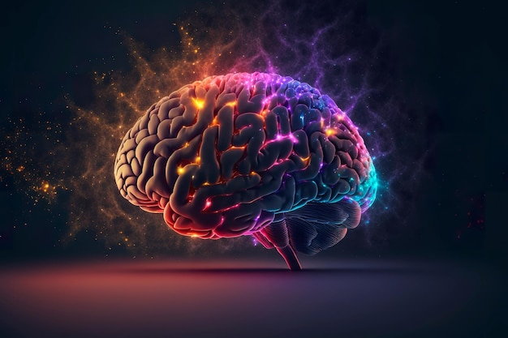
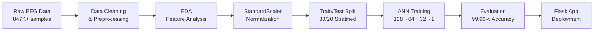

<p align="center">
  
</p>

<h1 align="center">🧠 NeuroSense — EEG-Based Alzheimer's Disease Diagnosis</h1>

<p align="center">
  <b>An AI-powered system for early detection of Alzheimer's Disease using EEG signals & Artificial Neural Networks</b>
</p>

<p align="center">
  
  
  
  
</p>

<p align="center">
  
  
  
  
</p>

---

## 📌 About

**NeuroSense** is a complete end-to-end machine learning project that detects Alzheimer's Disease from **16-channel EEG (Electroencephalogram) signals** using a custom-built **Artificial Neural Network (ANN)**. The trained model is deployed through an interactive **Flask web application** that provides:

- ⚡ **Real-time prediction** — Input EEG values, get instant Alzheimer's diagnosis
- 📊 **Interactive EEG visualization** — Plotly-powered simulated waveforms  
- 🏥 **Hospital Finder** — Locate Alzheimer's specialist hospitals on an interactive map
- 🔐 **User authentication** — Secure login system

---

## 🎯 Key Results

| Metric | Score |
|:-------|:------|
| **Test Accuracy** | 99.96% |
| **ROC AUC** | 1.0000 |
| **Precision** | 0.9996 |
| **Recall** | 0.9996 |
| **F1 Score** | 0.9996 |
| **R² Score** | 0.9986 |

> Trained on **847,000+ EEG samples** with class-weight balancing and early stopping.

---

## 🏗️ Architecture

### ANN Model
```
Input (16 EEG channels)
    │
    ▼
Dense(128, ReLU) → Dropout(0.3)
    │
    ▼
Dense(64, ReLU)  → Dropout(0.3)
    │
    ▼
Dense(32, ReLU)
    │
    ▼
Dense(1, Sigmoid) → Output (0: Healthy, 1: Alzheimer's)
```

### EEG Channels Used
| Channel | Brain Region | Function |
|---------|-------------|----------|
| Fp1, Fp2 | Frontopolar | Attention & Executive |
| F3, F4, Fz | Frontal | Executive Function & Working Memory |
| F7, F8 | Lateral Frontal | Language, Memory & Cognition |
| C3, C4, Cz | Central | Motor & Sensorimotor |
| T3, T4 | Temporal | Memory Encoding & Retrieval |
| T5 | Parietal-Temporal | Spatial Processing |
| P3, P4, Pz | Parietal | Spatial Awareness & Integration |

---

## 📸 Application Screenshots

### Login Page
- Secure authentication with `user123` / `pw123`
- Image carousel with Alzheimer's awareness info
- Accordion sections: What is Alzheimer's, Prevention Tips, Diagnosis Methods

### Prediction Dashboard
- Enter 16 EEG channel values with tooltip explanations
- Get instant prediction with confidence score
- Interactive Plotly EEG waveform visualization

### Hospital Finder
- 30+ hospitals across 6 Indian cities
- Interactive Leaflet.js map with markers
- Filter by city, sort by name/city
- Google Maps directions link

---

## 📂 Project Structure

```
NeuroSense/
├── 📓 EDA.ipynb                    # Exploratory Data Analysis
├── 📓 model_building.ipynb         # Model Training & Evaluation
├── 📊 AD_all_patients.csv          # Raw EEG Dataset (~111MB)
├── 📊 cleaned.csv                  # Preprocessed Dataset
├── 🎥 SampleVideo.mp4             # Project Demo Video
│
├── alzheimers_app/                 # Flask Web Application
│   ├── app.py                      # Main Flask app (routes & logic)
│   ├── alzheimers_model.h5         # Trained Keras model
│   ├── scaler.pkl                  # Fitted StandardScaler
│   ├── alz_hospitals.csv           # Hospital dataset
│   ├── geocode_cache.json          # Geocoding cache
│   ├── templates/
│   │   ├── base.html               # Shared layout
│   │   ├── login.html              # Login page
│   │   ├── predict.html            # Prediction page
│   │   ├── hospitals.html          # Hospital finder
│   │   └── skull_eeg_1020.html     # 3D EEG visualization
│   └── static/
│       ├── style.css               # Custom styles
│       └── images/                 # UI images
│
├── Documentation/                  # Research papers & references
├── skull-downloadable/             # 3D skull model assets
├── requirements.txt                # Python dependencies
└── README.md
```

---

## 🚀 Getting Started

### Prerequisites
- Python 3.10+
- pip

### Installation

```bash
# 1. Clone the repository
git clone https://github.com/darshansalimath/NeuroSense.git
cd NeuroSense

# 2. Install dependencies
pip install -r requirements.txt

# 3. Navigate to the app directory
cd alzheimers_app

# 4. Run the Flask app
python app.py
```

### Usage
1. Open `http://127.0.0.1:5000` in your browser
2. Login with credentials: **user123** / **pw123**
3. Enter EEG channel values on the **Predict** page
4. View the diagnosis result, confidence score, and EEG visualization
5. Navigate to **Hospitals** to find Alzheimer's specialist hospitals near you

---

## 🛠️ Tech Stack

| Category | Technologies |
|:---------|:-------------|
| **Language** | Python, JavaScript, HTML5, CSS3 |
| **ML / DL** | TensorFlow, Keras, scikit-learn |
| **Data** | Pandas, NumPy, MNE |
| **Visualization** | Plotly, Matplotlib, Seaborn |
| **Backend** | Flask, Jinja2 |
| **Frontend** | Bootstrap 5, Leaflet.js, Font Awesome |
| **Geocoding** | Nominatim (OpenStreetMap) |
| **Tools** | Jupyter Notebook, Git, Google Colab |

---

## 📈 ML Pipeline



**Training Configuration:**
- Optimizer: Adam
- Loss: Binary Crossentropy
- Epochs: 10 (with EarlyStopping, patience=5)
- Batch Size: 32
- Class Weights: Healthy=1.259, Alzheimer's=0.829

---

## 📚 References

- [Machine and Deep Learning Trends in EEG-Based Detection of Alzheimer's Disease](https://www.mdpi.com/2673-4117/5/3/78)
- [LEAD: Large Foundation Model for EEG-Based Alzheimer's Disease Detection](https://arxiv.org/abs/2502.01678)
- [Application of ANN in Diagnosis of Alzheimer's Disease — BMC Neurology](https://bmcneurol.biomedcentral.com/articles/10.1186/s12883-019-1377-4)
- [Alzheimer's Disease Detection Using Deep Learning — Springer](https://link.springer.com/article/10.1007/s10462-025-11258-y)
- [See full list →](Documentation/documentation.txt)

---

## 👤 Author

**Darshan A Salimath**  
B.E. in Information Science & Engineering  
Cambridge Institute of Technology, Bengaluru

[](https://github.com/darshansalimath)
[](https://linkedin.com/in/darshansalimath)

---

## 📄 License

This project is for academic and educational purposes only.  
The EEG dataset and research papers belong to their respective authors and publishers.

---

<p align="center">
  <b>⭐ Star this repo if you found it useful!</b>
</p>
